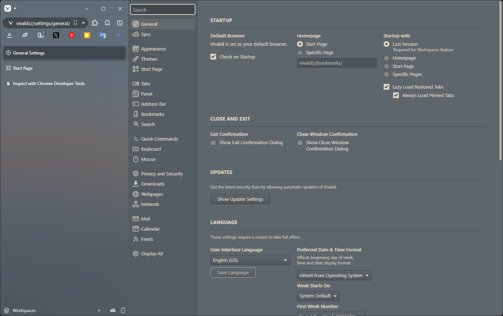

# Vivaldi Sidebar

## Overview
This CSS was inspired by "Vivaldi HV" and created for my own use.

It is a simpler layout with flat design.

Changing the size and position of the sidebar cannot be done using CSS alone.

As per the license, you may modify it to your own liking and redistribute it.

