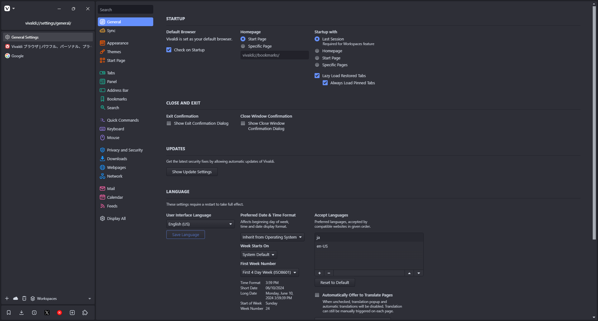
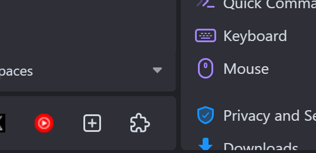

# Vivaldi Sidebar

## 概要
### これは何?
自分用に作った、VivaldiのUIをサイドバーに詰め込むカスタムCSSです。
Arcブラウザや、VivaldiCommunityのVivaldiVHからインスパイアを受けました。
### 特徴

- 煩雑にならないよう標準的なCSSと200行に満たないコード
- Opera Oneを参考に、モジュール式のデザインを取り入れました。
- 横の面積を圧迫しないよう、パネルバーを下部に移動しました。
- パネルとタブバーを両立させるようにしました。

## 適用方法
1. このリポジトリをクローン or ダウンロード
2. 適当なところに移動させる
3. `vivaldi://experiments`に移動
4. カスタムCSSを有効化
5. 設定>外観に移動
6. ダウンロードしたパスを設定
7. 再起動

## 要件
- タブバーは左に移動させてください。
- ツールバーは上に移動させてください。
- パネルバーは左に移動させてください。
- パネルはすべてフローティングさせてください。
- メインツールバーはアドレスバーのみにしてください。

## カスタマイズ
CSSファイルの先頭、\*セレクターのフォントをいじることでUIフォントを設定できます。

CSSファイルの5行目、browserセレクター内の変数をいじることである程度レイアウトをカスタマイズ可能です。

|変数|説明|デフォルト|
|---|---|---|
|--column-height|ツールバーとパネルバーの高さ|46px|
|--pane-margin|ペイン同士の余白の大きさ|4px|
|--sidebar-width|サイドバーの横幅|300px|
|--panelbar-colum|パネルバーの行数|1|
|--mainbar-column|ツールバーの行数^1|2|
> ^1 1行目はウィンドウコントロールとメインメニューボタンがあるため、1以上を推奨
## 課題(気が向いたらやります)
- レイアウトの自由度を高める
- 一部のテーマでタブバー上のワークスペースボタンの背景が意図しない色になる問題
- 二段タブスタックの調整
