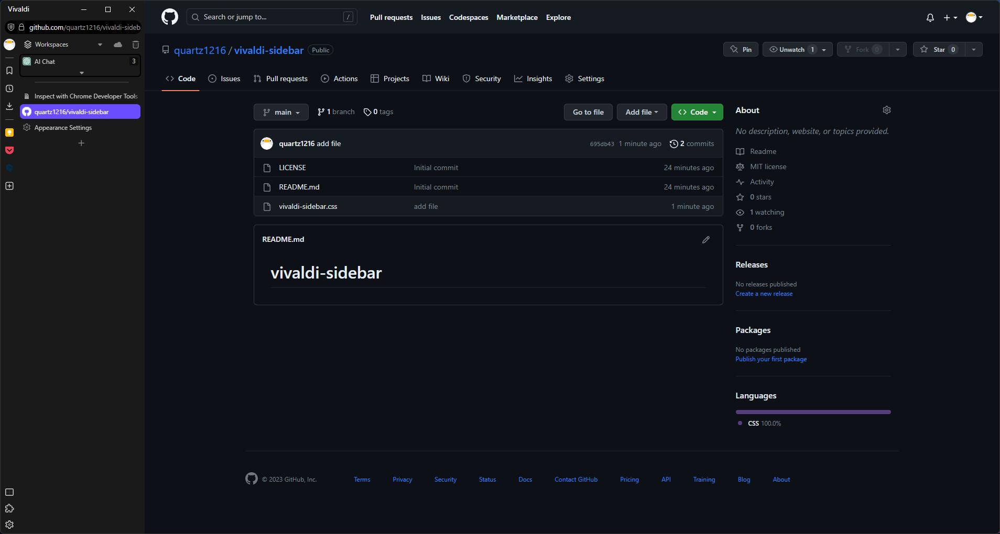

# Vivaldi Sidebar

## 概要
このCSSは､｢Vivaldi HV｣から発想を得て､自分用に制作したものです｡
影などの装飾がなく､よりシンプルなレイアウトに｡そしてカスタマイズ性を失ったものです｡

ライセンスの通り､自分の好みに改変してしても良いですし､それを再配布しても構いません｡

## 必要な設定
設定しなければならない項目は以下のとおりです｡

- Status Bar --> Status Info Overlay
- Menu Position --> Vivaldi Button
- Tab Bar Position --> Left
- Panel Position --> Left Side
- Address Bar Position --> Top
- Display Trash Can --> True
- Display Synced Tabs Button --> True
- Show Workspace in Tab Bar --> True

ツールバーのアイテムはこのように配置してください｡
- Toolbar Items --> アドレスバーのみ
- Panel Items --> 自由に配置してください
